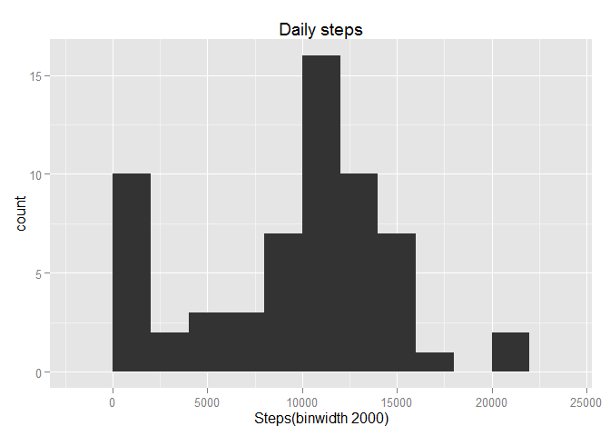
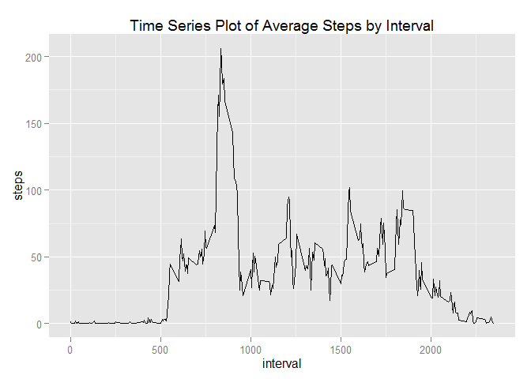

# Reproducible Research: Peer Assessment 1


## Loading and preprocessing the data


```r
#Load the data (i.e. read.csv())
df <- read.csv("activity.csv")

#Process/transform the data (if necessary) into a format suitable for your analysis

df$date <- as.Date(df$date)

## What is mean total number of steps taken per day?
```

```r
#histogram of the total number of steps taken each day
library(ggplot2)
```

```
## Warning: package 'ggplot2' was built under R version 3.2.2
```

```r
total_steps_by_day <- aggregate(x = df$steps , by = list(df$date), FUN = sum ,na.rm=TRUE)
names(total_steps_by_day) <- c("date","steps")
histplot <- ggplot(total_steps_by_day,aes(x = steps)) +
            ggtitle("Daily steps") +
            xlab("Steps(binwidth 2000)") +
            geom_histogram(binwidth = 2000)
histplot
```

 

```r
 dev.copy(png,'figure/histo_number_steps_each_day.png')
```

```
## png 
##   3
```

```r
 dev.off()
```

```
## png 
##   2
```

```r
#mean total number of steps taken per day
mean(total_steps_by_day$steps , na.rm = TRUE)
```

```
## [1] 9354.23
```

```r
#median total number of steps taken per day
median(total_steps_by_day$steps , na.rm = TRUE)
```

```
## [1] 10395
```

## What is the average daily activity pattern?


```r
#Time series plot of 5-minute interval and the average number of steps taken, averaged across all days
average_steps_by_interval  <- aggregate(x = df$steps , by = list(df$interval), FUN = mean ,na.rm=TRUE)
names(average_steps_by_interval) <- c("interval","steps")

avg.step.line <- ggplot(average_steps_by_interval,aes(interval,steps)) +
                 ggtitle("Time Series Plot of Average Steps by Interval") +
                 geom_line()


avg.step.line  
```

 

```r
 dev.copy(png,'figure/time_series_plot_average_steps_interval.png')
```

```
## png 
##   3
```

```r
 dev.off()
```

```
## png 
##   2
```

```r
#The 5-min time interval contains the maximum number of steps?
average_steps_by_interval[which.max(average_steps_by_interval$steps),c("interval")]
```

```
## [1] 835
```

## Imputing missing values


```r
#total number of missing values in the dataset
nrow(df[is.na(df$steps),])
```

```
## [1] 2304
```

```r
#imputing missing step values with mean step at time interval
df.inputed <- merge(x = df, y = average_steps_by_interval, by = "interval", all.x = TRUE)
df.inputed[is.na(df.inputed$steps.x),c("steps.x")] <- df.inputed[is.na(df.inputed$steps.x),c("steps.y")]

#cleaning data
df.inputed$date <- as.Date(df.inputed$date)
df.inputed$date.x <- NULL
df.inputed$Group.1 <- NULL
df.inputed$steps <- df.inputed$steps.x
df.inputed$steps.x <- NULL
df.inputed$steps.y <- NULL

#histogram with new dataframe
total_steps_by_day <- aggregate(x = df.inputed$steps , by = list(df.inputed$date), FUN = sum ,na.rm=TRUE)
names(total_steps_by_day) <- c("date","steps")
histplot <- ggplot(total_steps_by_day,aes(x = steps)) +
            ggtitle("Histogram of daily steps after imputation") +
            xlab("Steps (binwidth 2000)") +
            geom_histogram(binwidth = 2000)
histplot 
```

 

```r
 dev.copy(png,'figure/tdaily_steps_intervals_after_inputation.png')
```

```
## png 
##   3
```

```r
 dev.off()
```

```
## png 
##   2
```

```r
#mean total number of steps taken per day
mean(total_steps_by_day$steps , na.rm = TRUE)
```

```
## [1] 10766.19
```

```r
#median total number of steps taken per day
median(total_steps_by_day$steps , na.rm = TRUE)
```

```
## [1] 10766.19
```


## Are there differences in activity patterns between weekdays and weekends?


```r
#Factor variable with two levels indicating a weekday or weekend.
df.inputed$weekday <- as.factor(ifelse(weekdays(df.inputed$date) %in% c("Saturday","Sunday"), "Weekend", "Weekday")) 

average_steps_by_interval_and_weekday  <- aggregate(x = df.inputed$steps , 
                                                    by = list(df.inputed$interval,df.inputed$weekday), FUN = mean ,na.rm=TRUE)
names(average_steps_by_interval_and_weekday) <- c("interval","weekday","steps")

#panel time series plot of the 5-minute interval and the average number of steps taken 
#averaged across all weekday days or weekend days.
avg.step.line <- ggplot(average_steps_by_interval_and_weekday,aes(interval,steps)) +
                 ggtitle("Time Series Plot of Average Steps by Interval after Imputation") +
                 facet_grid(. ~ weekday) +
                 geom_line(size = 1)

 
avg.step.line  
```

 

```r
dev.copy(png,'figure/Time_Series_Plot_Average_Steps_by_Interval_after_Imputation.png')
```

```
## png 
##   3
```

```r
 dev.off()
```

```
## png 
##   2
```

